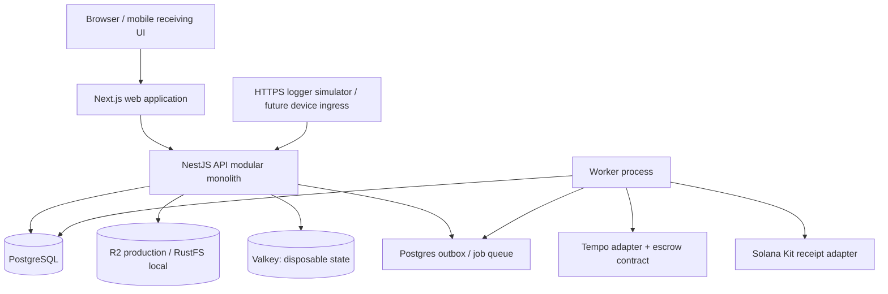

# Nischit architecture

## Decision summary

Nischit should start as a **modular monolith**, not a microservice fleet. The application has one deployable API, one web application, and one worker process that share domain packages and database migrations. Internal modules own their business rules behind small interfaces; infrastructure integrations are adapters at explicit seams.

This shape keeps operational behavior in one understandable system while preserving seams for independently deployed modules if measured load, resilience, or organizational ownership justifies that change.

## System topology



## Deployable units

### `apps/web`

Next.js App Router and TypeScript using Astryx components and the Nischit Butter theme. It renders tenant-scoped screens, mobile receiving workflows, QA queues, verification reports, and operational dashboards. The browser never decides the tenant or permission; it displays context supplied by the API and sends an explicit tenant context with each request.

### `apps/api`

NestJS using the Fastify adapter. The API is the only public application interface for business actions. It authenticates the request, resolves the active tenant, authorizes the action, validates input, opens a tenant-scoped database transaction, invokes the domain module, writes an outbox event, and returns a result.

### `apps/worker`

The worker process polls PostgreSQL outbox entries and is the planned home for condition aggregation, document hashing, notifications, settlement submission, chain confirmation, recall propagation, and export generation. The current worker acknowledges the small audit-event handler and leaves unknown topics retryable. Delivery is at least once; handlers must be idempotent and persist retry state. Valkey is not the durable job store.

## Domain modules

Each module should have a small public interface and hide its implementation. Do not expose repositories, ORM models, or chain SDK objects to other modules.

- **Identity and tenancy** — memberships, roles, active tenant, collaboration grants.
- **Catalog** — products, storage profiles, units, supplier/manufacturer references.
- **Procurement** — purchase orders, versioned acceptance policies, supplier acknowledgement.
- **Logistics and evidence** — shipments, lots, documents, device provenance, condition reports.
- **Receiving and inventory** — goods receipts, inventory events, allocations, transfers, consumption, waste, quarantine.
- **Quality** — exception evaluation, QA decisions, approval requirements, policy overrides.
- **Settlement** — release/adjust/hold/refund/dispute state and reconciliation.
- **Recall** — affected lot graph, quarantine propagation, acknowledgements, closure.
- **Audit and verification** — append-only application timeline, commitments, exports, and deliberately redacted public verification view.

The modules should communicate through domain commands and events, not by reaching into one another's tables. A synchronous call is fine inside the monolith when the caller needs an immediate result; the outbox is used for work that can retry or run later.

## Stable interfaces and adapters

Create interfaces for the parts that are expected to vary:

```text
IdentityProvider
ObjectStore
PaymentRail
PublicAttestationRail
NotificationSender
ConditionEvidenceSource
Clock
IdGenerator
```

Initial adapters:

```text
Rauthy OIDC callback → signed HttpOnly Nischit session; BearerJwtIdentityProvider remains available for non-browser service integrations
S3ObjectStore
TempoPaymentRail (configured escrow contract and TIP-20 approval/settlement)
SolanaMemoAttestationRail (`@solana/kit` memo receipt)
EmailNotificationSender
SignedLoggerEvidenceSource
SystemClock
```

The domain receives plain values and returns decisions/results. It does not import `viem`, `@solana/kit`, Rauthy SDK objects, or database entities. The chain implementations live in `packages/chains`; this keeps the core testable and makes Nepal fiat settlement, a future bank/PSP adapter, or a customer-hosted storage adapter possible without changing QA and inventory rules.

## Chain responsibilities

### Tempo

Tempo is an optional payment adapter. The contract records an opaque order reference, terms commitment, funded amount, QA decision commitment, settlement status, and adjustment/refund consequence. Use an opaque settlement reference in any transfer memo, not a human-readable PO number. Payment amounts and wallet addresses are publicly observable; do not publish additional confidential terms, documents, raw telemetry, patient data, or inventory. Enable a live payment environment only after contract review, signer custody design, and end-to-end reconciliation checks.

### Solana

Solana is a public attestation/receipt rail, not a second operational database. Write a compact receipt containing an opaque reference, evidence/decision commitment, and confirmed Tempo transaction reference when attesting to payment. Use `@solana/kit`. A signed memo proves publication by a signer, not independent verification of another chain or enforcement of QA authority. Decide the precise verification semantics before deciding whether a custom program is needed.

The two adapters reconcile independently; there is no atomic cross-chain settlement. Solana downtime must not cause another Tempo payment. Document the receipt behavior for operators; a chain integration alone does not establish production readiness or prove a business outcome.

### Nepal deployment

The production Nepal payment adapter must be a fiat or licensed-PSP integration until Nepal legal counsel and NRB provide a basis for any other structure. The chain adapters remain optional deployment capabilities, not assumptions embedded in the domain.

## Why not microservices now

Microservices would duplicate tenancy checks, event contracts, deployment, observability, and local development before Nischit has proven its workflow. The modular monolith keeps locality: the lot ledger, QA decision, and settlement consequence can be tested together. A module can be extracted later behind the same interface if there is a measured need.

## Source-of-truth rule

PostgreSQL is the operational source of truth. Confirmed chain state is authoritative for actual on-chain funds movement; the database stores a reconciled projection, not an independent assertion that money moved. Object storage holds private evidence. Valkey holds disposable state. The application queries its database for workflows and reconciles payment projections through the chain adapter.

See [workflow invariants](workflow-invariants.md) for mandatory rules on units, inventory conservation, QA authority, commitments, and retries. See [deployment](deployment.md) for the VPS topology. These are planned units, not existing services.
